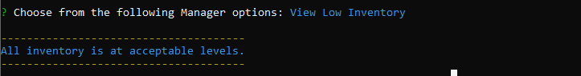
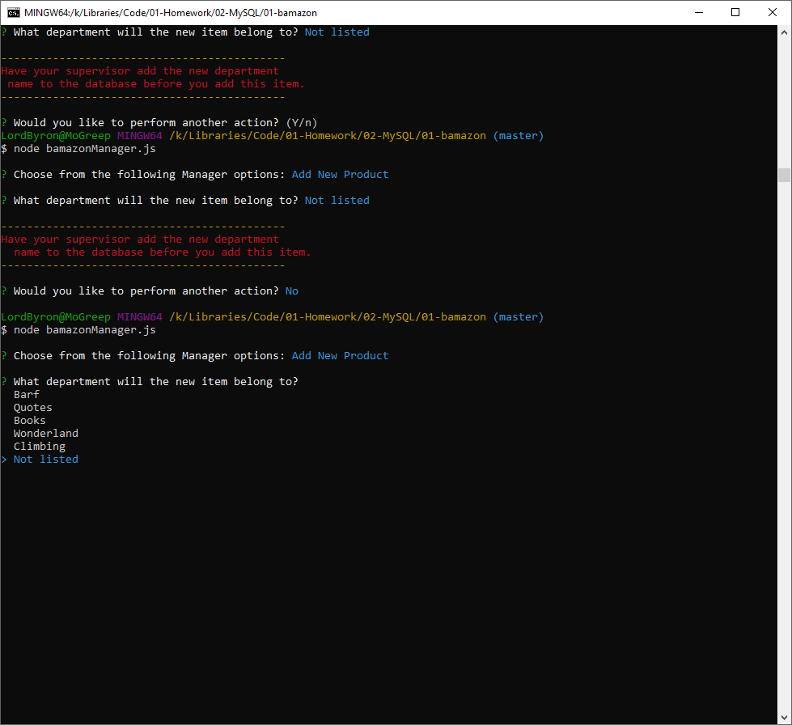
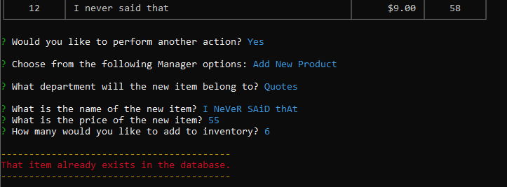
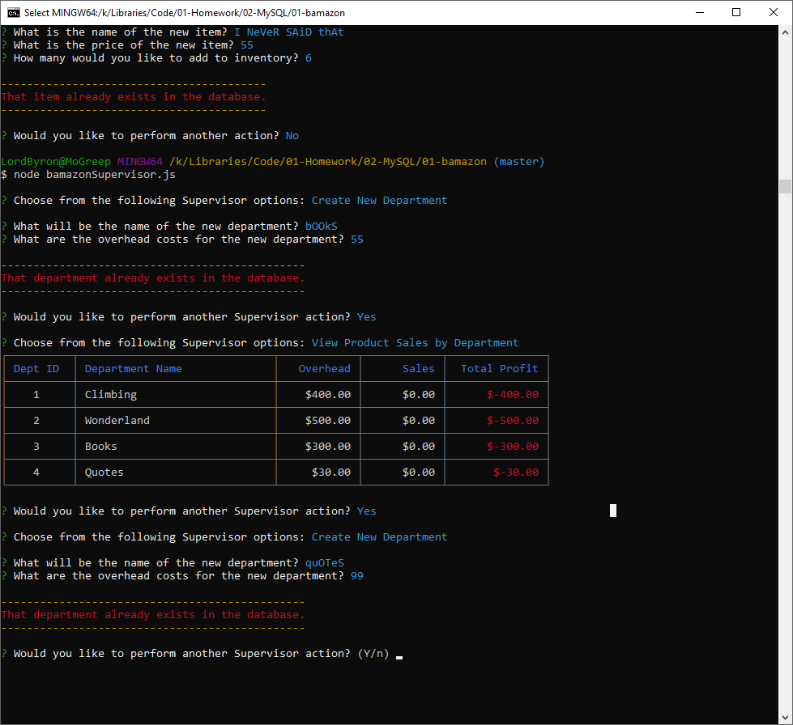
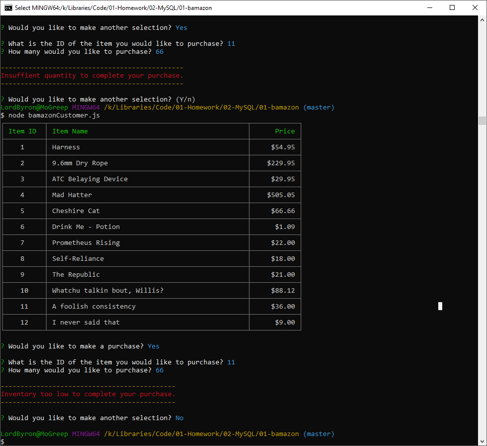

# Bamazon Storefront
  
## :mag: Table of contents :mag:
  
### [1-Description](https://github.com/Strangebrewer/01-bamazon#Description)
### [2-Technologies](https://github.com/Strangebrewer/01-bamazon#Technologies)
### [3-Challenges](https://github.com/Strangebrewer/01-bamazon#Challenges)
### [4-Demonstration](https://github.com/Strangebrewer/01-bamazon#Demonstration)

---
### 1-Description :page\_facing\_up:
Mock Storefront CLI application with three levels of interaction with a MySQL database. There is the Customer interface for buying, the Manager interface for managing inventory, and the Supervisor interface for viewing total profits and adding new product categories.

---
### 2-Technologies  :computer:
  This project utilizes the following technologies:
- JavaScript
- [MySQL](https://www.mysql.com/)
- [Node.js](https://nodejs.org/en/)
- Node packages:
  - [mysql](https://www.npmjs.com/package/mysql)
  - [inquirer](https://www.npmjs.com/package/inquirer)
  - [colors](https://www.npmjs.com/package/colors)
  - [cli-table2](https://www.npmjs.com/package/cli-table2)
  
  ---
### 3-Challenges
This project is an exercise in reading and manipulating a MySQL database via Node.js. The main challenges include using recursion and callbacks, data validation and guarding against duplicate entries, and moderately complex (from a beginner standpoint) MySQL commands involving joins, aliases, and grouping. Lesser challenges include learning new Node packages - in this case, mysql and cli-table2.

### 4-Demonstration
 #### GIFs
  Customer view - making purchases and then exiting the program:
  

  Manager View - checking inventory, checking low inventory, adding inventory, adding a new item to the database, and checking inventory again:
  

  Supervisor View - checking profits by department and adding a new department name to the database:
  

  Manager View - creating a new item in the new department the supervisor just created:
  

 #### Screen Shots
  Manager View - all inventory at acceptable levels:
  
  
  Manager View - choosing 'Not Listed' from department listing for new item results in error message:
  

  Manager View - Attempting to add an item that already exists results in an error message:
  

  Supervisor View - Attempting to add a department name that already exists results in an error message:
  

  Customer View - Insufficient inventory:
  