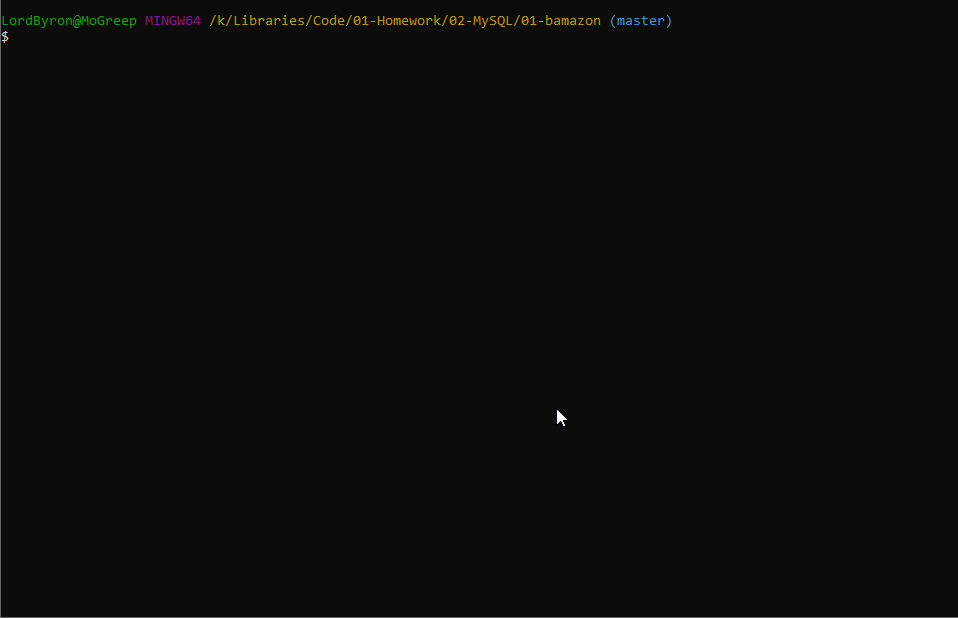
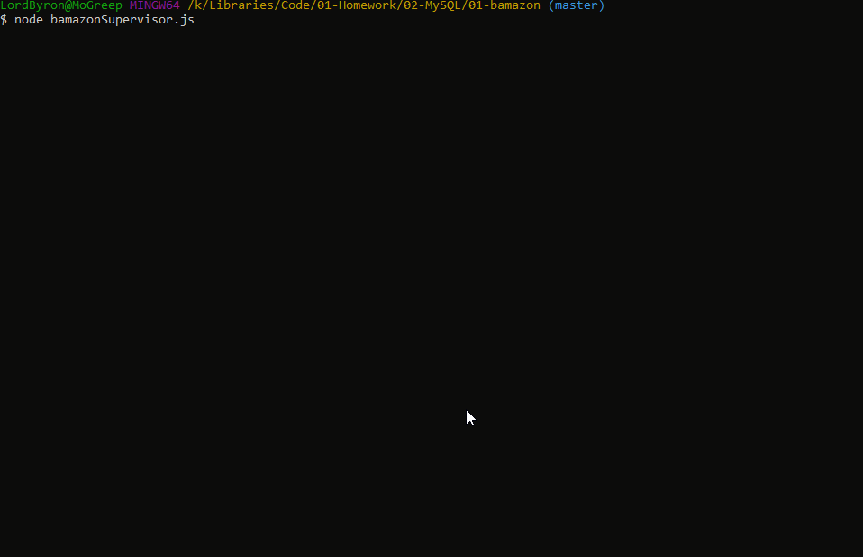
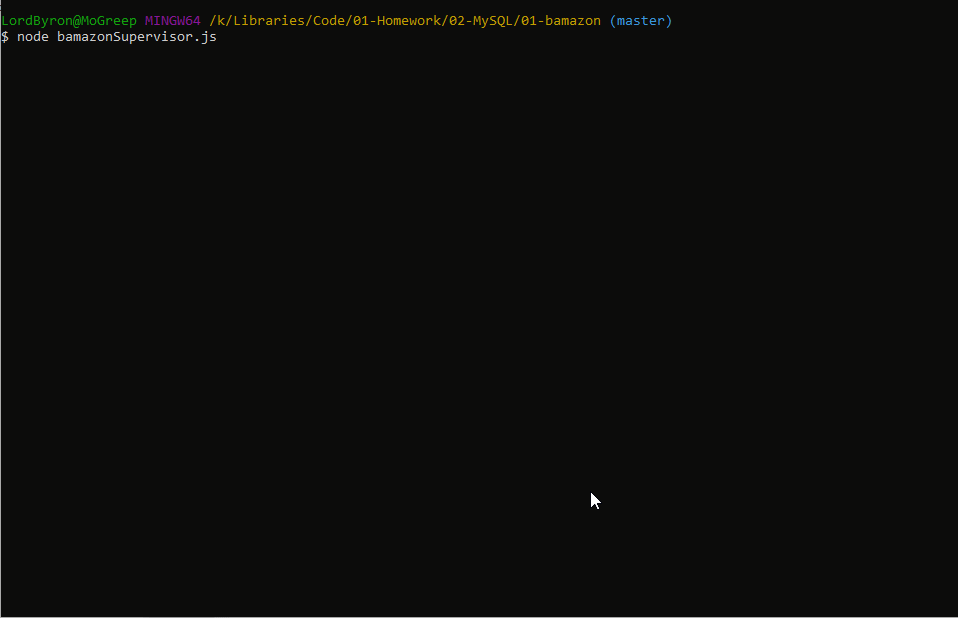
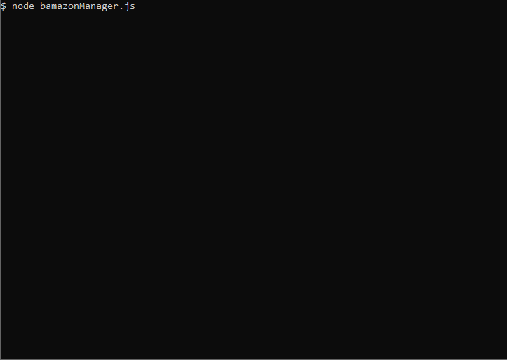

# 01-bamazon

# Bamazon Storefront
  
## :mag: Table of contents :mag:
  
### [1-Description](https://github.com/Strangebrewer/01-bamazon#Description)
### [2-Technologies](https://github.com/Strangebrewer/01-bamazon#Technologies)

---
### 1-Description :page\_facing\_up:
Mock Storefront CLI program with three levels of interaction with a MySQL database. There is the Customer interface for buying, the Manager interface for managing inventory, and the Supervisor interface for viewing total profits and adding new product categories.

---
### 2-Technologies  :computer:
  This project utilizes the following technologies:
- JavaScript
- [MySQL](https://www.mysql.com/)
- [Node.js](https://nodejs.org/en/)
- Node packages:
  - [mysql](https://www.npmjs.com/package/mysql)
  - [inquirer](https://www.npmjs.com/package/inquirer)
  - [colors](https://www.npmjs.com/package/colors)
  - [cli-table2](https://www.npmjs.com/package/cli-table2)
  
  ---

### 3-Demo GIFs and Screen Shots
  Customer view shows making purchases and then exiting the program:
  

  Manager View shows manager checking inventory, checking low inventory, adding inventory, and adding a new item to the database:
  

  Supervisor View shows the supervisor checking profits by department, and adding a new department name to the database:
  

  Supervisor creating a new department name:
  

  Manager creating a new item in the new department the supervisor just created:
  
  